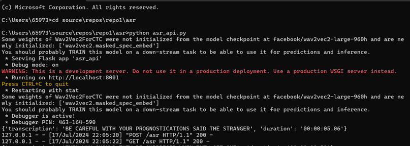
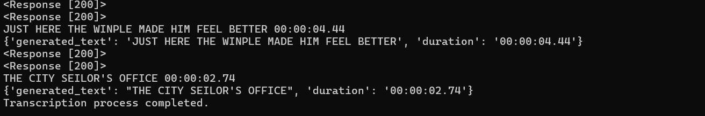
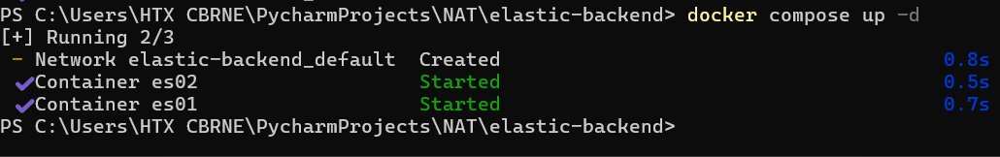
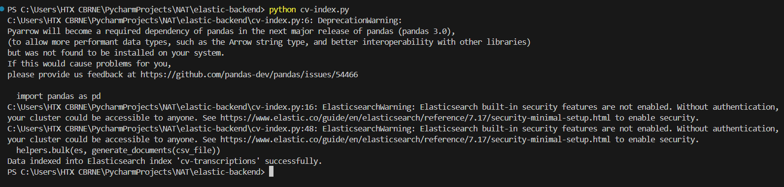
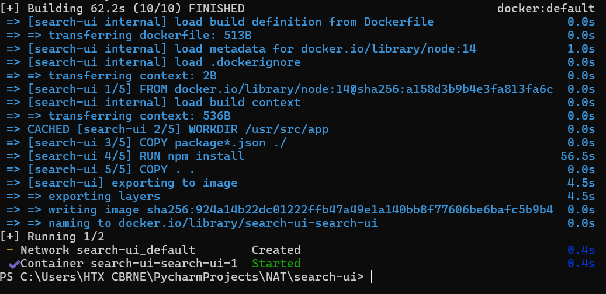

# Description

The project involves building a comprehensive pipeline to process and analyze a dataset of common-voice recordings using various technologies and APIs. Here’s a breakdown of the tasks and deployment:

1) Ping Test to serve as health check to verify service's availability.
2) Inference API for Hugging Face model to handle requests to transcribe audio files into text.
3) A python code to automate transcription of 4,076 audio files into a csv, with the assistance of inference API to generate transcription.
4) Utilizing Elasticsearch as a backend to create a search index for records within csv.
5) Deploying Search-UI as a web application frontend to allow users to search through the dataset using specific fields.
6) Extends the project by deploying Elasticsearch and Search-UI on to a public cloud env

## Setting up
1) clone the repository from https://github.com/natashakoh12/repo1. You should be able to see the following Directory Structure:

- Repo1
	- asr/
		- pingAPI.py
		- asr_api.py
		- cv-decode.py
		- harvard.mp3
		- cv-valid-dev.csv
	- deployment_design/
		- design.pdf
	- elastic-backend/
		- cv-index.py
		- cv-valid-dev.csv
		- docker-compose.yml
	- search-ui/
		- app/
			- src/
				- App.css
				- App.js
			- Dockerfile
			- package
		- docker-compose.yml
	- essay.pdf
	- .gitignore
	- README.txt
	- requirements.txt

2) Install all libraries and packages listed in the requirements.txt
3) (optional) To put them into your system PATH environment variable as required to ensure access from any directory in command prompt

## Task 2(b)
1) cd into the correct directory (.../repo1/asr) and run 'pingAPI.py'. 
You can then either:
- Open 'http://localhost:8001/ping' in browser to see Pong

- Send a curl command and see pong in command prompt
```
curl http://localhost:8001/ping
```

2) You should also see a response 200 to indicate successful connection


## Task 2(c)
1) Ensure the audio file that you wish to transcribe and the ffmpeg.exe are in the same directory as 'asr_api.py'. In my case, I used the audio file 'havard.mp3' to test.
2) Run 'asr_api.py" in one command prompt and send a curl command in another
```
curl -F "file=@C:\Users\65973\source\repos\repo1\asr\harvard.mp3" http://localhost:8001/asr
```
3) The transcription and duration of uploaded audio file will reflect as a dictionary on command prompt that is running 'asr_api.py'. On the command prompt with the curl command, it will print a message 'temp file deleted'


## Task 2(d)
1) Download the dataset and ensure it is in the same directory as 'cv_decode.py'
2) In the downloaded dataset folder 'cv-valid-dev', add in a 'cv-valid-dev.csv' file
3) Run 'asr_api.py" in one command prompt and run 'cv-decode.py' in another
4) The transcription and duration of each audio file will be appended into the 'cv-valid-dev.csv' file, one row each for every audio file uploaded. If both 'asr_api.py' and 'cv-decode.py' run successfully, you should be able to see response 200 for both GET and POST request, with the transcription and duration printed on command prompt.

5) At the end of the process, a message 'Transcription process completed' will be displayed

6) My 'cv-valid-dev.csv' file with the generated text and duration has been uploaded in the asr folder for your view


## Task 3(a)
1) Refer to design.pdf under deployment-design folder

## Task 4
1) Ensure the 'cv-valid-dev.csv' file is in the same directory as 'cv-index.py'
1) cd into the correct directory (.../repo1/elastic-backend) and run the following to compose, create container and or image and run the docker container using Docker Compose.
```
docker-compose up -d
```


2) Once it is running successfully, open container in terminal and run 'cv-index.py' file


## Task 5
1) cd into the correct directory (.../repo1/search-ui) and run the following command
```
docker-compose up -d
```


## Task 6
I was not able to deploy my solution as I was having trouble accessing EC2 instance after launching, to install my Docker. I could not access via SSH. 

Hence I wrote down the steps I would have conducted below:
1) [Completed] Launch two EC2 instances (t2.micro for free tier) with Amazon Linux 2 AMI.
2) [Completed] Configure security groups to allow inbound traffic on ports 9200 (Elasticsearch) and 3000 (Search-UI).
3) [Attempted] Install Docker on both instances via SSH. 
4) Transfer 'elastic-backend' directory to the EC2 instance
5) SSH into the instance and run Docker Compose
6) Repeat Step 4 & 5 for 'search-ui'
7) Generally, I do not need to perform indexing again if elastic-backend Docker was set up with persistent storage/volume. Since my 'docker-compose.yml' file correctly defines and uses volumes for Elasticsearch data, it should not require me to index my csv file again.

## Task 8
1) Refer to essay.pdf under the main folder (repo1)


