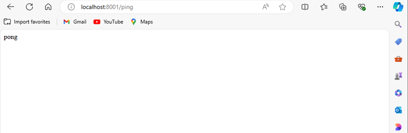
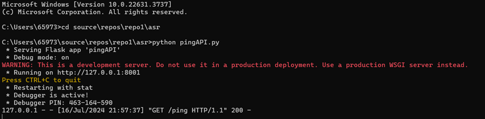
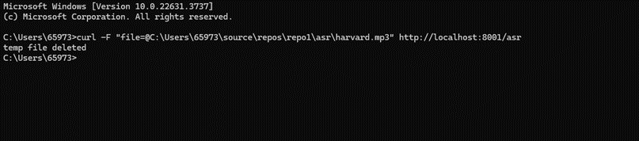
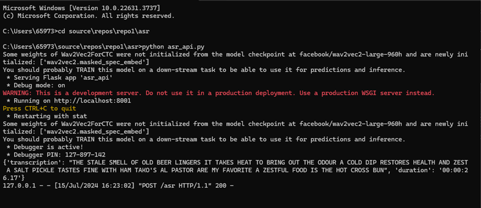

# Description

The project involves building a comprehensive pipeline to process and analyze a dataset of common-voice recordings using various technologies and APIs. Here’s a breakdown of the tasks and deployment:

1) Ping Test to serve as health check to verify service's availability.
2) Inference API for Hugging Face model to handle requests to transcribe audio files into text.
3) A python code to automate transcription of 4,076 audio files into a csv, with the assistance of inference API to generate transcription.
4) Utilizing Elasticsearch as a backend to create a search index for records within csv.
5) Deploying Search-UI as a web application frontend to allow users to search through the dataset using specific fields.
6) Extends the project by deploying Elasticsearch and Search-UI on to a public cloud env

## Setting up
1) clone the repository from https://github.com/natashakoh12/repo1. You should be able to see the following Directory Structure:

- Repo1
	- asr/
		- pingAPI.py
		- asr_api.py
		- cv-decode.py
		- harvard.mp3
	- deployment_design/
		- design.pdf
	-elastic-backend/
		- cv-index.py
		- docker-compose.yml
	-search-ui/
		- app/
			- src/
				-App.css
				-App.js
			- Dockerfile
			- package
		- docker-compose.yml
	-essay.pdf
	-.gitignore
	-README.txt
	-requirements.txt

2) Install all libraries and packages listed in the requirements.txt
3) (optional) them into your system PATH environment variable as required to ensure access from any directory in command prompt

## Task 2(b)
1) cd into the correct directory (.../repo1/asr) and run 'pingAPI.py'. 
You can then either:
- Open 'http://localhost:8001/ping' in browser to see Pong

- send a curl command and see pong in command prompt

'''
curl http://localhost:8001/ping
'''
2) You should also see a response 200 to indicate successful connection

##Task 2(c)
1) Ensure the audio file that you wish to transcribe and the ffmpeg.exe are in the same directory as 'asr_api.py'. In my case, I used the audio file 'havard.mp3' to test.
2) Run 'asr_api.py" in one command prompt and send a curl command in another
'''
curl -F "file=@C:\Users\65973\source\repos\repo1\asr\harvard.mp3" http://localhost:8001/asr
'''
3) The transcription and duration of uploaded audio file will reflect as a dictionary on command prompt.

#Task 2(d)
1) Download the dataset and ensure it is in the same directory as 'cv_decode.py'

# Task 3(a)
1) Refer to design.pdf under deployment-design folder

# Task 4

# Task 5

# Task 6

# Task 7

# Task 8
1) Refer to essay.pdf under the main folder (repo1)

